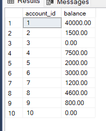
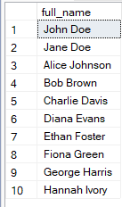
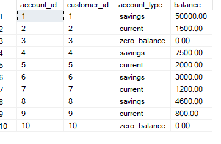
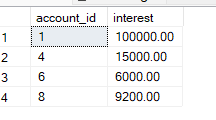
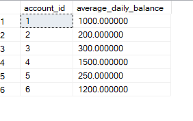

```sql CREATE TABLE Customers (
customer_id INT PRIMARY KEY,
first_name VARCHAR(50),
last_name VARCHAR(50),
DOB DATE,
email VARCHAR(100),
phone_number VARCHAR(15),
address VARCHAR(255)
);

INSERT INTO Customers (customer_id, first_name, last_name, DOB, email, phone_number, address) VALUES
(1, 'John', 'Doe', '1980-01-01', 'john.doe@email.com', '1234567890', '123 Street'),
(2, 'Jane', 'Doe', '1985-02-02', 'jane.doe@email.com', '0987654321', '456 Avenue'),
(3, 'Alice', 'Johnson', '1975-03-30', 'alice.johnson@example.com', '1234567880', '789 Pine Road'),
(4, 'Bob', 'Brown', '1982-06-18', 'bob.brown@example.com', '2345678901', '321 Birch Lane'),
(5, 'Charlie', 'Davis', '1995-11-12', 'charlie.davis@example.com', '8765432109', '654 Cedar Drive'),
(6, 'Diana', 'Evans', '1988-04-25', 'diana.evans@example.com', '5678901234', '987 Spruce Street'),
(7, 'Ethan', 'Foster', '1979-08-30', 'ethan.foster@example.com', '3456789012', '159 Fir Court'),
(8, 'Fiona', 'Green', '1992-12-01', 'fiona.green@example.com', '7890123456', '753 Walnut Way'),
(9, 'George', 'Harris', '1983-03-14', 'george.harris@example.com', '2109876543', '852 Chestnut Boulevard'),
(10, 'Hannah', 'Ivory', '1991-09-19', 'hannah.ivory@example.com', '4321098765', '951 Palm Road');
select \* from Customers;
```

---

```sql
Accounts Table
CREATE TABLE Accounts (
account_id INT PRIMARY KEY,
customer_id INT,
account_type VARCHAR(50),
balance DECIMAL(15, 2),
FOREIGN KEY (customer_id) REFERENCES Customers(customer_id)
);
-- Insert additional values into Accounts Table
INSERT INTO Accounts (account_id, customer_id, account_type, balance) VALUES
(1, 1, 'savings', 5000.00),
(2, 2, 'current', 1500.00),
(3, 3, 'zero_balance', 0.00),
(4, 4, 'savings', 7500.00),
(5, 5, 'current', 2000.00),
(6, 6, 'savings', 3000.00),
(7, 7, 'current', 1200.00),
(8, 8, 'savings', 4600.00),
(9, 9, 'current', 800.00),
(10, 10, 'zero_balance', 0.00);
select \* from Accounts;
```

---

```sql
 Transactions Table
CREATE TABLE Transactions (
transaction_id INT PRIMARY KEY,
account_id INT,
transaction_type VARCHAR(50),
amount DECIMAL(15, 2),
transaction_date DATE,
FOREIGN KEY (account_id) REFERENCES Accounts(account_id)
);
-- Insert values into Transactions Table
INSERT INTO Transactions (transaction_id, account_id, transaction_type, amount, transaction_date) VALUES
(1, 1, 'deposit', 1000.00, '2024-01-15'),
(2, 2, 'withdrawal', 200.00, '2024-02-10'),
(3, 3, 'transfer', 300.00, '2024-03-05'),
(4, 4, 'deposit', 1500.00, '2024-04-20'),
(5, 5, 'withdrawal', 250.00, '2024-05-18'),
(6, 6, 'deposit', 1200.00, '2024-06-22'),
(7, 7, 'transfer', 500.00, '2024-07-14'),
(8, 8, 'deposit', 600.00, '2024-08-09'),
(9, 9, 'withdrawal', 100.00, '2024-09-25'),
(10, 10, 'deposit', 400.00, '2024-10-30');
select \* from Transactions;
```

---

```sql
CREATE TABLE InterestRates (
interest_rate_id INT PRIMARY KEY,
account_type VARCHAR(50),
interest_rate DECIMAL(5, 2)
);
-- Insert values into InterestRates Table
INSERT INTO InterestRates (interest_rate_id, account_type, interest_rate) VALUES
(1, 'savings', 1.50),
(2, 'current', 0.75),
(3, 'zero_balance', 0.00),
(4, 'fixed_deposit', 2.00),
(5, 'recurring_deposit', 1.80),
(6, 'senior_savings', 2.00),
(7, 'child_savings', 1.25),
(8, 'high_yield_savings', 2.25),
(9, 'business_account', 1.00),
(10, 'student_account', 0.50);
select \* from InterestRates;
```

---

```sql
 Create Branches Table
CREATE TABLE Branches (
branch_id INT PRIMARY KEY,
branch_name VARCHAR(100),
address VARCHAR(255)
);

-- Insert values into Branches Table
INSERT INTO Branches (branch_id, branch_name, address) VALUES
(1, 'Downtown', '100 Main Street'),
(2, 'Uptown', '200 Broadway Avenue'),
(3, 'Suburban', '300 Maple Lane'),
(4, 'Riverside', '400 River Road'),
(5, 'Mountain View', '500 Hilltop Drive'),
(6, 'Lakeside', '600 Lake Avenue'),
(7, 'Eastside', '700 East Boulevard'),
(8, 'Westside', '800 West Street'),
(9, 'Northside', '900 North Road'),
(10, 'Southside', '1000 South Avenue');
select \* from Branches;
```

---

```sql
2.Write a SQL query to retrieve the name, account type, and email of all customers.
SELECT Customers.first_name, Customers.last_name, Accounts.account_type, Customers.email
FROM Customers
INNER JOIN Accounts
ON Customers.customer_id = Accounts.customer_id;
```


---

```sql
3. Write a SQL query to list all transactions along with the corresponding customer.
SELECT Transactions.\*, Customers.first_name, Customers.last_name
FROM Transactions
INNER JOIN Accounts ON Transactions.account_id = Accounts.account_id
INNER JOIN Customers ON Accounts.customer_id = Customers.customer_id;
```

## 

```sql
4. Write a SQL query to increase the balance of a specific account by a certain amount.
select account_id,balance
from Accounts
UPDATE Accounts
SET balance = balance +10000
WHERE account_id = 1;
```

## 

```sql
5. Write a SQL query to combine the first and last names of customers as `full_name`.
SELECT CONCAT(first_name, ' ', last_name) AS full_name FROM Customers;
```



---

```sql
6. Write a SQL query to remove accounts with a balance of zero where the account type is savings.
select \* from Accounts
DELETE FROM Accounts WHERE balance = 0.00 AND account_type = 'savings';
```



---

```sql
7. Write a SQL query to find customers living in a specific city.
SELECT \* FROM Customers WHERE address LIKE '753 Walnut Way';
```

## 

```sql
8. Write a SQL query to get the account balance for a specific account.
select \* from Accounts;
SELECT balance FROM Accounts WHERE account_id = 4;
```

## 

```sql
9.Write a SQL query to calculate the interest accrued on savings accounts based on a given interest rate.
select _ from Accounts;
SELECT account_id, balance _ 2 AS interest
FROM Accounts
WHERE account_type = 'savings';
```



---

```sql
10. Write a SQL query to find the average account balance for all customers.
SELECT AVG(balance) as average_balance
FROM Accounts;
```


---

```sql
11.Write a SQL query to calculate the average daily balance for each account over a specified period.
select \* from Transactions;
SELECT account_id, AVG(amount) as average_daily_balance
FROM Transactions
WHERE transaction_date BETWEEN '2024-01-15' AND '2024-07-01'
GROUP BY account_id;
```



---

```sql
12.Identify accounts with the highest number of transactions ordered by descending order.
select \* from Transactions;
SELECT account_id, COUNT(transaction_id) as transaction_count
FROM Transactions
GROUP BY account_id
ORDER BY transaction_count DESC;
```


---

```sql
13. List customers with high aggregate account balances, along with their account types.
SELECT c.customer_id,c.first_name,c.last_name,a.account_type,SUM(a.balance) AS total_balance
FROM Customers c
JOIN Accounts a ON c.customer_id = a.customer_id
GROUP BY c.customer_id, c.first_name, c.last_name, a.account_type
HAVING SUM(a.balance) > 3000 -- Replace 1000 with the threshold you consider "high"
ORDER BY total_balance DESC;
```


---

```sql
14.Identify and list duplicate transactions based on transaction amount, date, and account.
select _ from Transactions;
SELECT account_id, transaction_type, amount, transaction_date, COUNT(_) AS transaction_count
FROM Transactions
GROUP BY account_id, transaction_type, amount, transaction_date
HAVING COUNT(\*) > 1
ORDER BY
transaction_count DESC,
account_id,
transaction_date;
```


---

```sql
15.Calculate the total balance for each account type, including a subquery within the SELECT clause.
SELECT account_type, (
SELECT SUM(balance)
FROM Accounts AS sub_accounts
WHERE sub_accounts.account_type = main_accounts.account_type) as total_balance
FROM Accounts AS main_accounts
GROUP BY account_type;
```


---
